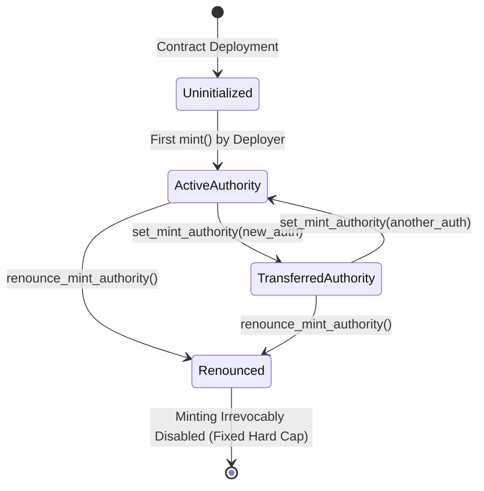
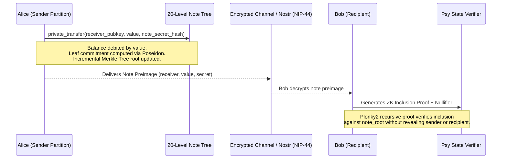

# Psy Protocol Smart Contract Asset Standards Design Specification

This document provides the foundational architectural specification, state layout definitions, asset lifecycles, and security invariants for smart contracts built on the Psy Protocol.

---

## 1. Architectural Foundations & Philosophy

Psy Protocol is a zero-knowledge native (ZK-native) blockchain built upon client-side recursive proving and state partitioning. The architecture is engineered around the following core axioms:

### 1.1 Goldilocks Prime Field Arithmetic
All contract execution, memory representations, and state values exist within the Plonky2 Goldilocks field $\mathbb{F}_p$, where the prime modulus is:
$$p = 2^{64} - 2^{32} + 1$$
- The primitive data type in Psy-lang is `Felt` (Field Element).
- Every storage slot, balance, account identifier (`user_id`), contract identifier (`contract_id`), and event argument occupies one or more `Felt` elements.
- Field arithmetic operates with native 64-bit field operations, ensuring optimal circuit proving efficiency.

### 1.2 User-Partitioned State Tree
State in Psy is structured as a hierarchical Sparse Merkle Tree partitioned by user identity:
- **No Global Contention**: Contracts do not maintain a single shared global state table. Instead, state is isolated per user partition:
  $$\text{State}(contract\_id, user\_id)$$
- **Local Write Exclusivity**: A transaction executed by `caller = get_user_id()` can only mutate the caller's own state partition (`ContractMetadata::current()`).
- **Cross-Partition Read Verification**: A contract can read the state of any arbitrary user partition via:
  ```rust
  let other_contract = ContractRef::new(ContractMetadata::new(get_contract_id(), target_user_id));
  ```
  The client prover supplies an inclusion proof verifying the target user's state root against the consensus state root without requiring a write lock.

### 1.3 Asynchronous Asset Flow: The Outbox/Claim Pattern
Because cross-user writes are cryptographically prohibited to maintain horizontal scalability, asset transfers between users utilize an asynchronous **Outbox/Claim (Push-Pull)** protocol:
1. **Transfer Phase (Push)**: User $A$ updates their local state partition, deducting their balance and recording the sent amount/token into an Outbox table indexed by recipient $B$.
2. **Claim Phase (Pull)**: User $B$ reads User $A$'s Outbox, asserts the pending transfer, records the claimed amount in their own state to synchronize nonces, and credits their local balance.

---

## 2. PSY-20: Fungible Token Standard Specification

The PSY-20 standard defines the protocol for divisible, fungible assets within user-partitioned state trees.

### 2.1 Storage Layout

```rust
#[derive(Storage)]
pub struct OtherUserInfo {
    pub amount_sent: Felt,
    pub amount_claimed: Felt,
}

#[derive(Storage)]
pub struct DelegationChannel {
    pub spender: Felt,
    pub allocated_amount: Felt,
    pub spent_amount: Felt,
}

#[contract]
#[derive(Storage)]
pub struct PsyTokenContract {
    pub balance: Felt,
    pub mint_authority: Felt,
    pub is_mint_renounced: Felt,
    pub other_user_info: [OtherUserInfo; 16777216],
    pub delegations: [DelegationChannel; 16],
    pub note_count: Felt,
    pub note_root: Hash,
    pub last_path: [Hash; 20],
}
```

- **`balance`** (Slot 0): The caller's liquid token balance within their partition.
- **`mint_authority`** (Slot 1): The account authorized to mint new supply.
- **`is_mint_renounced`** (Slot 2): A binary flag (`0` or `1`) indicating whether the mint authority has been permanently and irreversibly destroyed.
- **`other_user_info`** (Slot 3..): The Outbox mapping storing pending and historical outgoing transfers to other accounts.
- **`delegations`** (Slot 33554435..): Dedicated, isolated spending channels allocated for delegated third-party callers.
- **`note_count`** (Slot 33554483): Monotonically increasing count of shielded note commitments inserted into the partition's Merkle tree.
- **`note_root`** (Slot 33554484..33554487): The current Merkle root of the partition's 20-level Incremental Merkle Tree (IMT).
- **`last_path`** (Slot 33554488..33554567): Cached rightmost frontier branch of the 20-level IMT for $O(1)$ amortized note insertion.

---

### 2.2 Mint Authority Lifecycle

Tokens in Psy follow a strictly defined authority lifecycle:



1. **Self-Initialization**: The first caller to execute `mint()` establishes themselves as `mint_authority` if `mint_authority == 0`.
2. **Authority Transfer**: The existing `mint_authority` may transfer the role to a new account using `set_mint_authority(new_authority)`.
3. **Irrevocable Renunciation**: The `mint_authority` may call `renounce_mint_authority()`, which sets `is_mint_renounced = 1` and `mint_authority = 0`. Once renounced, further minting is mathematically impossible, establishing a provably fixed maximum supply.

---

### 2.3 Core Methods & State Transitions

#### `mint(amount: Felt)`
- **Pre-conditions**:
  - `is_mint_renounced == 0`
  - `caller == mint_authority` (or `mint_authority == 0` for initialization)
- **State Mutation**:
  - `c.balance += amount`
- **Events**: Emits `MintEvent { to: caller, amount: amount }`

#### `burn(amount: Felt)`
- **Pre-conditions**:
  - `c.balance >= amount`
- **State Mutation**:
  - `c.balance -= amount`
- **Events**: Emits `BurnEvent { amount: amount }`

#### `transfer(recipient: Felt, amount: Felt)`
- **Pre-conditions**:
  - `recipient != caller`
  - `amount > 0`
  - `c.balance >= amount`
- **State Mutation**:
  - `c.balance -= amount`
  - `c.other_user_info[recipient].amount_sent += amount`
- **Events**: Emits `TransferEvent { to: recipient, amount: amount }`

#### `claim(sender: Felt)`
- **Pre-conditions**:
  - `sender != caller`
  - `sender_contract.other_user_info[caller].amount_sent > my_contract.other_user_info[sender].amount_claimed`
- **State Mutation**:
  - `claimable = sender_info.amount_sent - my_info.amount_claimed`
  - `c.balance += claimable`
  - `c.other_user_info[sender].amount_claimed = sender_info.amount_sent`
- **Events**: Emits `ClaimEvent { from: sender, amount: claimable }`

#### `private_transfer(receiver: Hash, value: Felt, note_secret_hash: Hash)`
- **Pre-conditions**:
  - `value > 0`
  - `c.balance >= value`
  - `c.note_count < 1048576` (tree capacity $2^{20}$)
- **Poseidon Note Commitment**:
  $$\text{leaf}_0 = \text{hash\_two\_to\_one}(\text{receiver}, [\text{value}, 0, 0, 0])$$
  $$\text{commitment} = \text{hash\_two\_to\_one}(\text{leaf}_0, \text{note\_secret\_hash})$$
- **State Mutation**:
  - `c.balance -= value`
  - Appends `commitment` into the 20-level Incremental Merkle Tree (`c.last_path`, `c.note_root`)
  - `c.note_count += 1`
- **Events**: Emits `PrivateTransferEvent { commitment: commitment, note_index: c.note_count }`

#### `batch_transfer_2` / `batch_transfer_5`
- Executes parallel Outbox updates across multiple recipients in a single atomic ZK transaction circuit, deducting the aggregated sum from `c.balance`.

---

### 2.4 Sandboxed Delegation Channels

Rather than allowing arbitrary third parties unconstrained access to inspect and debit an account's primary balance, Psy Protocol introduces **Sandboxed Delegation Channels**:

```mermaid
sequenceDiagram
    participant Owner as Token Owner
    participant Channel as DelegationChannel[idx]
    participant Spender as Spender (Agent / Contract)
    participant Recipient as Recipient User
    
    Owner->>Channel: open_delegation_channel(idx, spender, amount)
    Note over Owner,Channel: balance is immediately debited by amount;<br/>escrowed into channel slot.
    Spender->>Channel: spend_delegation(idx, spend_amount, recipient)
    Note over Channel,Recipient: spent_amount increments by spend_amount;<br/>recipient outbox credited via atomic Outbox entry.
    Owner->>Channel: revoke_delegation_channel(idx)
    Note over Owner,Channel: unspent = allocated - spent;<br/>unspent refunded to Owner balance.<br/>Channel cleared to 0.
```

#### Core Delegation Methods:
- **`open_delegation_channel(channel_idx: Felt, spender: Felt, amount: Felt)`**:
  - Debits `amount` from `c.balance` and initializes `delegations[channel_idx] = { spender, allocated_amount: amount, spent_amount: 0 }`.
- **`spend_delegation(channel_idx: Felt, amount: Felt, recipient: Felt)`**:
  - Pre-conditions: `ch.spender != 0`, `ch.allocated_amount - ch.spent_amount >= amount`.
  - Mutates `ch.spent_amount += amount` and credits `c.other_user_info[recipient].amount_sent += amount` without touching owner's primary liquid balance.
  - Emits `SpendDelegationEvent { channel_idx, spender, recipient, amount }`.
- **`revoke_delegation_channel(channel_idx: Felt)`**:
  - Pre-conditions: `ch.spender != 0`.
  - Refunds unspent allowance (`ch.allocated_amount - ch.spent_amount`) back to `c.balance` and resets the channel to 0.
  - Emits `RevokeDelegationEvent { channel_idx, refunded_amount: unspent }`.

#### Invariants of Delegation Channels:
1. **Strict Balance Segregation**: When a channel is opened, `amount` is debited from `c.balance` and locked into `delegations[idx]`. The owner's remaining balance is physically unreachable by the spender.
2. **Channel Isolation**: Channel indices are independent ($0 \le \text{idx} < 16$), allowing simultaneous delegations to distinct spenders without cross-contamination.
3. **Immediate Revocation & Refund**: The owner may revoke a channel at any time. Any unspent balance ($\text{allocated\_amount} - \text{spent\_amount}$) is credited back to `c.balance` atomically.

---

### 2.5 Shielded Private Transfers (Zero-Knowledge Note Commitments)

In addition to transparent Outbox transfers, PSY-20 natively supports shielded private note generation via `private_transfer`. This protocol shields transparent balances into cryptographic note commitments within a local 20-level Incremental Merkle Tree (IMT):



#### Note Commitment Construction
Each private note is represented as a 2-to-1 Poseidon hash commitment over the Goldilocks field $\mathbb{F}_p$:
$$\text{leaf}_0 = \text{Poseidon}(\text{receiver}, [\text{value}, 0, 0, 0])$$
$$\text{commitment} = \text{Poseidon}(\text{leaf}_0, \text{note\_secret\_hash})$$

Where:
- `receiver`: The recipient's 256-bit public key hash (`[Felt; 4]`).
- `value`: The token denomination.
- `note_secret_hash`: The blinding factor / entropy hash ensuring note unlinkability (`[Felt; 4]`).

#### 20-Level Incremental Merkle Tree (IMT)
- **Capacity**: $2^{20} = 1,048,576$ shielded notes per user partition.
- **Deterministic frontier insertion**: uses `last_path` to track the right-edge active branch, updating the `note_root` in $O(\log N)$ arithmetic constraints within the execution circuit.
- **Double-Spend Prevention**: Claiming a note publishes a deterministic nullifier $\text{Poseidon}(\text{note\_secret}, \text{note\_index})$. Once recorded, re-spending the note is mathematically prevented.

---

## 3. PSY-721: Non-Fungible Token Standard Specification

The PSY-721 standard defines the protocol for unique, non-fungible digital assets with slot-indexed partition storage.

### 3.1 Storage Layout

```rust
#[derive(Storage)]
pub struct NFTSlot {
    pub token_id: Felt,
    pub is_active: Felt,
}

#[derive(Storage)]
pub struct NFTOutbox {
    pub token_id: Felt,
    pub nonce_sent: Felt,
    pub nonce_claimed: Felt,
}

#[contract]
#[derive(Storage)]
pub struct PsyNFTContract {
    pub balance: Felt,
    pub mint_authority: Felt,
    pub is_mint_renounced: Felt,
    pub owned_tokens: [NFTSlot; 128],
    pub outbox: [NFTOutbox; 16777216],
}
```

- **`owned_tokens: [NFTSlot; 128]`**: A fixed-size array of active NFT holding slots within the user's partition.
- **`outbox: [NFTOutbox; 16777216]`**: An asynchronous transit queue storing pending outgoing token transfers mapped by recipient identifier.
- **`balance`**: The count of currently active NFTs owned by this user partition.

---

### 3.2 Core Methods & State Transitions

#### `mint(slot_idx: Felt, token_id: Felt)`
- **Pre-conditions**:
  - `slot_idx < 128`
  - `token_id > 0`
  - `is_mint_renounced == 0`
  - `caller == mint_authority` (or self-initialization)
  - `c.owned_tokens[slot_idx].is_active == 0`
- **State Mutation**:
  - `c.owned_tokens[slot_idx] = NFTSlot { token_id: token_id, is_active: 1 }`
  - `c.balance += 1`
- **Events**: Emits `NFTMintEvent { to: caller, token_id: token_id }`

#### `transfer(slot_idx: Felt, recipient: Felt)`
- **Pre-conditions**:
  - `slot_idx < 128`
  - `recipient != caller`
  - `c.owned_tokens[slot_idx].is_active == 1`
- **State Mutation**:
  - `token_id = c.owned_tokens[slot_idx].token_id`
  - `c.owned_tokens[slot_idx] = NFTSlot { token_id: 0, is_active: 0 }`
  - `c.balance -= 1`
  - `c.outbox[recipient] = NFTOutbox { token_id: token_id, nonce_sent: prev.nonce_sent + 1, nonce_claimed: prev.nonce_claimed }`
- **Events**: Emits `NFTTransferEvent { from: caller, to: recipient, token_id: token_id }`

#### `claim(slot_idx: Felt, sender: Felt)`
- **Pre-conditions**:
  - `slot_idx < 128`
  - `sender != caller`
  - `c.owned_tokens[slot_idx].is_active == 0` (target slot must be empty)
  - `sender_contract.outbox[caller].nonce_sent > c.outbox[sender].nonce_claimed`
- **State Mutation**:
  - `token_id = sender_contract.outbox[caller].token_id`
  - `c.owned_tokens[slot_idx] = NFTSlot { token_id: token_id, is_active: 1 }`
  - `c.balance += 1`
  - `c.outbox[sender].nonce_claimed = sender_contract.outbox[caller].nonce_sent`
- **Events**: Emits `NFTClaimEvent { to: caller, from: sender, token_id: token_id }`

---

## 4. Formal Security Invariants

All Psy asset implementations must satisfy the following formal properties:

| Invariant | Formal Definition | Verification Mechanism |
| :--- | :--- | :--- |
| **Conservation of Supply** | $\sum_i \text{balance}_i + \sum_{i,j} \text{unclaimed}_{i \to j} + \sum_i \text{notes}_i + \sum_{i, k} \text{escrow}_{i,k} = \text{Minted} - \text{Burned}$ | Enforced by balanced addition/subtraction in state transitions |
| **Nonce Monotonicity** | $\text{nonce}_{sent}^{(t+1)} > \text{nonce}_{sent}^{(t)}$ and $\text{nonce}_{claimed} \le \text{nonce}_{sent}$ | Enforced by strict counter increments in Outbox logic |
| **Slot Exclusivity** | $\forall i, \text{slot}[i].is\_active \in \{0, 1\}$ | Guarded by `assert(slot.is_active == 0)` on write |
| **Channel Non-Negative Balance** | $\text{spent\_amount} \le \text{allocated\_amount}$ | Guarded on channel mutation and refund computation |
| **Authority Immutability** | If `is_mint_renounced == 1`, then `mint_authority == 0` permanently | Guarded by `assert(is_mint_renounced == 0)` on every mint/set call |
| **Merkle Tree Frontier Integrity** | $0 \le \text{note\_count} \le 2^{20}$, $\text{note\_root}^{(t+1)} = \text{IMT}(\text{note\_root}^{(t)}, \text{commitment})$ | Enforced by deterministic Poseidon 2-to-1 folding across `last_path` frontier |

---

## 5. Toolchain & Compilation Pipeline

Contract templates in this repository integrate natively with `psyup` and `dargo`:

```
                 src/main.psy
                      │
                      ▼
               [dargo compile]
                      │
         ┌────────────┴────────────┐
         ▼                         ▼
   target/<name>.json      target/<name>.abi.json
   (ZK Circuit Artifact)     (Interface Specification)
```

- **Compilation**: Executed via `psyup build` (invokes `dargo compile`).
- **Unit Testing**: Executed via `dargo test --file <path>`.
- **Deployment**: Executed via `psyup deploy` (submits circuit verification keys and initial state commitments to the network).
